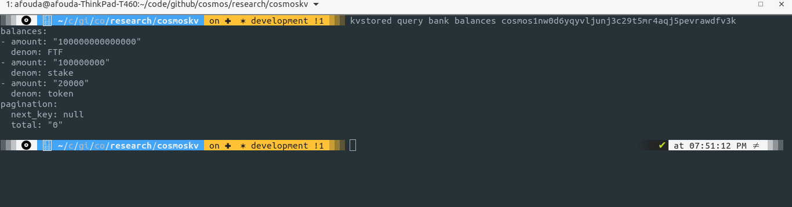

# Cosmos chain 
## installing starport
```
curl https://get.starport.com/starport! | bash
```
## Creating Cosmos chain
- Create chain using starport scaffolding 
```
starport scaffold chain github.com/<github_username>/simple_chain
``` 
# Deploying a cosmos chain from one node 
```
cd simple_chain
starport chain serve
```
# Adding GUI 
```
# in another terminal
cd vue
npm install
npm run serve
```
## Adding token
This can be simplly added by editing `config.yml` to include the new token to be something like this 

Then you can query the balances to make sure it is added 
