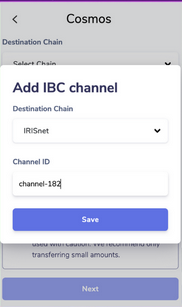

# IBC

IBC (interprocesss blockchain communication) is a protocol the enables different blockchains to communicate with each other. Modules communicating doesn't necessarily trust each other, that's why in each example we can see the resources created are prefixed with identifiers to specify its source.

## High level overview

### IBC Modules
IBC modules provides an interface for handling IBC messsages (i.e messages that originates from a different chain). Every module is associated with a specific port. For example, the transfer module in Cosmos, present by default when scaffolding a new chain using starport, is associated with "transfer" port.

### Ports
Every chain can contain multiple ports. A port is like a TCP port, it specifies which module that handles a specific message.

### Channels

For communication between two modules in two chains, a channel is created in the first and the second chain. Each with its own channel-id. Messages are stored at a place identified by the source channel and the source port. And then it's delivered (using relayers) at the destination port with the packet along with information about the IBC connection (source-channel-id, source-port-id, dest-channel-id, dest-port-id).

### Relayers

Relayers are apps that monitors data stored at specific locations indicating that a message to be delivered to another chain. And then it delivers these messages along with proof to the counter-party chain.

## Examples

### IBC real-world transfer

There are multiple relayers running by operators. Channel ids can be used to send tokens from a chain to another. For example, to transfer money from osmosis to cosmos, a channel id can be found on [osmosis-channels](https://mapofzones.com/zone?period=24&source=osmosis-1&tableOrderBy=success&tableOrderSort=desc&testnet=false). Then it can be entered in keplr along with the destination chain id. Then money can be transfered from osmosis to cosmos.



More Info:
- https://keplr.crunch.help/ibc-guides-troubleshooting/cosmos-ibc-transfers
- https://www.youtube.com/watch?v=dYuTYykRhH4

### IBC module transfer

A toy chain app with some tokens can be used to explain the transfer flow (not sure if it's the same as the above). By default, the ibc transfer module is available in scaffolded app. So the following steps can be used to test it.

1. `starport scaffold chain github.com/OmarElawady/cosmos-bank` to scaffold a new chain project
2. Create these files to create two different chain configurations:

chain1.yml:
```
accounts:
  - name: alice
    coins: ["20000token", "200000000stake"]
  - name: bob
    coins: ["10000token", "100000000stake"]
validator:
  name: alice
  staked: "100000000stake"
client:
  openapi:
    path: "docs/static/openapi.yml"
  vuex:
    path: "vue/src/store"
faucet:
  name: bob
  coins: ["5token", "100000stake"]
genesis:
  chain_id: "chain1"
init:
  home: "$HOME/.chain1"
genesis:
  chain_id: "chain1"
init:
  home: "$HOME/.chain1"
```
chain2.yml:
```
accounts:
  - name: alice
    coins: ["20000token", "200000000stake"]
  - name: bob
    coins: ["10000token", "100000000stake"]
validator:
  name: alice
  staked: "100000000stake"
client:
  openapi:
    path: "docs/static/openapi.yml"
  vuex:
    path: "vue/src/store"
faucet:
  name: bob
  host: ":4501"
  coins: ["5token", "100000stake"]
host:
  rpc: ":26659"
  p2p: ":26658"
  prof: ":6061"
  grpc: ":9092"
  grpc-web: ":9093"
  api: ":1318"
genesis:
  chain_id: "chain2"
init:
  home: "$HOME/.chain2"
genesis:
  chain_id: "chain2"
init:
  home: "$HOME/.chain2"
  ```
3. start both block chains in two different terminas:
```bash
starport chain serve -c chain1.yml
starport chain serve -c chain2.yml
```
4. Take not of addresses printed in the output of the `serve` command. Then execute the following to configure the relay (THIS WILL REMOVE OLD RELAYER CONFIG):
```bash
rm -rf ~/.starport/relayer # to clean up old relayers if any
starport relayer configure -a \
--source-rpc "http://0.0.0.0:26657" \
--source-faucet "http://0.0.0.0:4500" \
--source-port "transfer" \
--source-version "ics20-1" \
--source-gasprice "0.0000025stake" \
--source-prefix "cosmos" \
--source-gaslimit 300000 \
--target-rpc "http://0.0.0.0:26659" \
--target-faucet "http://0.0.0.0:4501" \
--target-port "transfer" \
--target-version "ics20-1" \
--target-gasprice "0.0000025stake" \
--target-prefix "cosmos" \
--target-gaslimit 300000
```
5. You can view the balances of each account by its address from `http://localhost:1317` for the first chain and `http://localhost:1318` for the second chain. Check them to see how the following operations affect the balances.
6. Executing this should transfer 200 tokens from bob's account in the first chain to another chain `cosmos-bankd tx ibc-transfer transfer transfer channel-0 <destination-address-on-chain2> 200token --from alice --home ~/.chain1 --chain-id chain1 --node tcp://localhost:26657`. Note that the tokens appears as `ibc/<hash>` which is a new denomination derived from the token in the sending chain, the destination channel id, and the destination port id. When transfered back, they appear as they were originally (i.e. `token`).
7. Transfering back can be done by `cosmos-bankd tx ibc-transfer transfer transfer channel-0 <alice-adddress> 200ibc/<some-hash> --from bob --home ~/.chain2 --chain-id chain2 --node tcp://localhost:26659`.

More info: https://github.com/cosmos/ibc/tree/master/spec/app/ics-020-fungible-token-transfer

### Starport planet project

A very simple project to create with scaffolding commands to show how an ibc-module can be created. Here four methods are created to handle messages when certain events occur for a specific packet type.

- `OnRecvIbcPostPacket` when receiving a new post packet.
- `OnAcknowledgementIbcPostPacket` receiving chains sends acknowlegements when receiving an ibc packet (can be an error or success). This method handles it.
- `OnTimeoutIbcPostPacket` when sending the packet times out.

The ibc cosmos module [interface](https://github.com/cosmos/cosmos-sdk/blob/release/v0.42.x/x/ibc/core/05-port/types/module.go) provides more hooks to add functionalities at different stages.


Link: https://docs.starport.com/guide/ibc.html#

## Links

- https://ibcprotocol.org contains tutorials and a paper to the ibc details
- https://docs.cosmos.network/v0.42/ibc/custom.html cosmos ibc docs
- https://docs.starport.com/guide/ibc.html# starport ibc docs
- https://github.com/cosmos/ibc/blob/master/spec/app/ics-020-fungible-token-transfer/README.md fungible tokens transfer

## In progress
- Looking into https://github.com/cosmos/ibc/tree/master/spec/core, should contain info about the internal workings of ibc